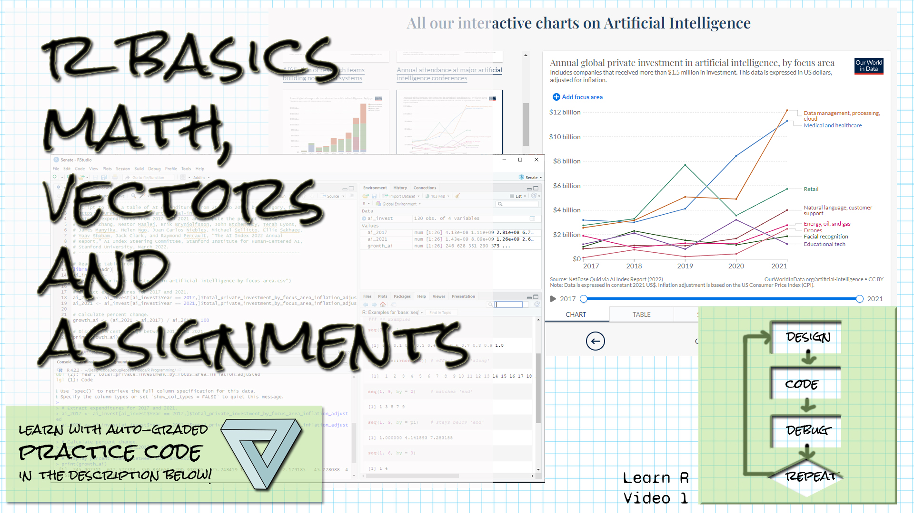

```{r setup, include=FALSE}
library(learnr)
library(gradethis)
library(readr)
knitr::opts_chunk$set(echo = FALSE)
ai_invest <- read_csv("data/private-investment-in-artificial-intelligence-by-focus-area.csv", skip = 1, col_names = c("Entity", "Code", "Year", "Invest"))
ai_2017 <- ai_invest[ai_invest$Year == 2017,]$Invest
ai_2021 <- ai_invest[ai_invest$Year == 2021,]$Invest

```

## Welcome!

```{r fig.margin = TRUE, echo = FALSE, fig.width=3, out.width="100%", fig.align="right"}

```


*These exercises align with the [Design Code Debug Repeat](https://www.youtube.com/@DesignCodeDebugRepeat ) [Introductory R video 1 on R basics (math, vectors, assignment)](https://youtu.be/vHPkicZrTi0).*

*If you haven't already watched [the video](https://youtu.be/vHPkicZrTi0), you might want to watch it first before trying these exercises.*

*Make sure you have the learnr, gradethis, and readr packages installed.*

*Here is the source for the data we're working with:
[Our World in Data's artificial intelligence data](https://ourworldindata.org/artificial-intelligence)
Daniel Zhang, Nestor Maslej, Erik Brynjolfsson, John Etchemendy, Terah Lyons, 
James Manyika, Helen Ngo, Juan Carlos Niebles, Michael Sellitto, Ellie Sakhaee, 
Yoav Shoham, Jack Clark, and Raymond Perrault, “The AI Index 2022 Annual 
Report,” AI Index Steering Committee, Stanford Institute for Human-Centered AI, 
Stanford University, March 2022.
*

## Assignment and calculations

*Remember that variables are names for values.  We can use the variable names to stand in for the values.  Usually we don't know, when we write a program, what the values will be.  Use the assignment operator <- to assign a value to a variable. Use the asterisk for multiplication and the / for division.*

Assign the value 413050561 to the variable agtech_2017, and assign the value 1428772088 to agtech_2021. (The numbers are already in the script for you so you don't have to type them.) Find the percent difference between 2017 and 2021 by first calculating the difference (the value for 2021 - 2017), and then dividing that by the value for 2017 and multiplying by 100.  The last line of your script should be the calculation of the percent difference.  If you assign the result to a variable, make the variable the last line of your script.  (Don't print it.)


```{r calc_numeric, exercise=TRUE}
413050561
1428772088
```

``` {r calc_numeric-hint-1}
When you're assigning, use <-.  The first assignment should be 
agtech_2017 <- 413050561
```

``` {r calc_numeric-hint-2}
To calculate the difference, write
diff <- agtech_2021 - agtech_2017
```


``` {r calc_numeric-hint-3}
Percent change is the difference divided by the original
value, multiplied by 100.  Use * for multiplication and
/ for division.
```


``` {r calc_numeric-hint-4}
Remember to make the percent change calculation the last line of your script.  
If you assign the calculation into a variable, make just the variable name 
the last line of your script.
```


``` {r calc_numeric-solution}
  agtech_2017 <- 413050561
  agtech_2021 <- 1428772088
  diff <- agtech_2021 - agtech_2017
  diff / agtech_2017 * 100
```


``` {r calc_numeric-check}
grade_result(
  pass_if(~ (round(.result[[1]]) == 246), "Well done! "),
  fail_if(~TRUE, "Try looking at the hints! ")
)
```

## Assignment and calculations on vectors

*The calculations you performed in the last exercise were calculations on vectors, although the vectors had a length of only one.  Do the same thing (calculate the percent change), but this time do it with the vectors ai_2017 and ai_2021.  (These vectors are already defined for you and come from the AI table of investments.)*

Calculate the percent change between ai_2017 and ai_2021, two vectors of length 26.  Make the result the last line of your script.


```{r calc_vector, exercise=TRUE}
# ai_2017 and ai_2021 are already defined for you

```

``` {r calc_vector-hint-1}
To calculate the difference, write
diff <- ai_2021 - ai_2017
```


``` {r calc_vector-hint-2}
Percent change is the difference divided by the original
value, multiplied by 100.  Use * for multiplication and
/ for division.
```


``` {r calc_vector-hint-3}
Remember to make the percent change calculation the last line of your script.  
If you assign the calculation into a variable, make just the variable name 
the last line of your script.
```


``` {r calc_vector-solution}
  diff <- ai_2021 - ai_2017
  diff / ai_2017 * 100
```


``` {r calc_vector-check}
grade_result(
  pass_if(~ (round(.result[[1]]) == 246), "Well done! "),
  fail_if(~TRUE, "Try looking at the hints! ")
)
```

## seq

*The seq function allows you to generate vectors by specifying the parameters of the sequence.  For example, in the help, we saw seq(1, 9, by = 2), which generated the vector 1 3 5 7 9.  Another named argument is length.out, which will generate a specific number of values within the range.*

*Write a seq command that will generate the values from 0 to 100 in increments of 5.*


```{r seq, exercise=TRUE}

```

``` {r seq-hint-1}
Put the start value and the end value as the first two arguments
to seq within parentheses.  The values are inclusive.
```

``` {r seq-hint-2}
If you want to count by a certain number in seq, put the
argument by = number (whatever number you want).
```


``` {r seq-hint-3}
The seq command should be the only line of code in your script.
```


``` {r seq-hint-4}
If you assigned the result to a variable, the variable name should
be the last line of your script.
```


``` {r seq-solution}
seq(0, 100, by = 5)
```


``` {r seq-check}
grade_result(
  pass_if(~ (.result == seq(0, 100, by = 5)), "Well done! "),
  fail_if(~TRUE, "Try looking at the hints! ")
)
```


## sum and length

*The sum function will total a vector, and the length function will give you the length of a vector (the number of elements in a vector).  We can use these functions to calculate an average.*

*Use sum() and length() to calculate the average of the ai_2021 vector (already defined).*


```{r sum_length, exercise=TRUE}

```

``` {r sum_length-hint-1}
Use sum(ai_2021) to get the total of all the values in the ai_2021 vector.
```


``` {r sum_length-hint-2}
Use length(ai_2021) to get the number of values in the ai_2021 vector.
```

``` {r sum_length-hint-3}
Divide the sum by the length to get the average.
```


``` {r sum_length-hint-4}
This exercise will be graded on you writing the code as exactly
the sum of ai_2021 divided by the length of ai_2021.
```

``` {r sum_length-solution}
sum(ai_2021) / length(ai_2021)
```


``` {r sum_length-check}
grade_this_code()
```


## A few questions...

We talked about a few other things in the videos.  Answer the questions below to test your knowledge.

```{r quiz}
quiz(
  question("How can you get help on a function in R / RStudio?",
    answer("?, followed by the function name", correct = TRUE),
    answer("search() with the function name in ()"),
    answer("help() with the function name in ()", correct = TRUE),
    answer("There is no built-in help")
  ),
  question("What is some good guidance for writing comments?",
    answer("Write who, not where"),
    answer("Write when, not how"),
    answer("Write what, not where"),
    answer("Write why, not what", correct = TRUE)
  ),
  question("What is the symbol that you put before a comment?",
    answer("//"),
    answer("&ast;"),  # HTML entity for *
    answer("&#35;", correct = TRUE),  # HTML entity for #
    answer("$")
  )
)

```

