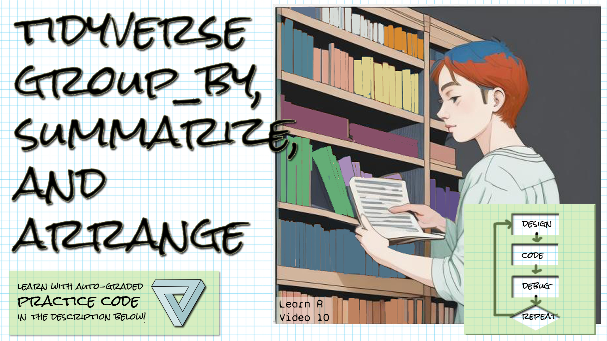

```{r setup, include=FALSE}
library(learnr)
library(gradethis)
library(tidyverse)
knitr::opts_chunk$set(echo = FALSE)
ai_data <- 
  read_csv("data/private-investment-in-artificial-intelligence-by-focus-area.csv",
           skip = 1,
           col_names = c("Entity", "Code", "Year", "Invest")) |> filter(Entity != "Total")

```

## Welcome!

```{r fig.margin = TRUE, echo = FALSE, fig.width=3, out.width="100%", fig.align="right"}

```


*These exercises align with the [Design Code Debug Repeat](https://www.youtube.com/@DesignCodeDebugRepeat ) [Introductory R video 10 summarize, group_by, and arrange in the tidyverse](https://youtu.be/IJbViWzhIQo).*

*If you haven't already watched [the video](https://youtu.be/IJbViWzhIQo), you might want to watch it first before trying these exercises.*

*Make sure you have the learnr, gradethis, and the tidyverse packages installed.*

*Here is the source for the data we're working with:
[Our World in Data's artificial intelligence data](https://ourworldindata.org/artificial-intelligence)
Daniel Zhang, Nestor Maslej, Erik Brynjolfsson, John Etchemendy, Terah Lyons, 
James Manyika, Helen Ngo, Juan Carlos Niebles, Michael Sellitto, Ellie Sakhaee, 
Yoav Shoham, Jack Clark, and Raymond Perrault, “The AI Index 2022 Annual 
Report,” AI Index Steering Committee, Stanford Institute for Human-Centered AI, 
Stanford University, March 2022.
*


## Summarize

*The AI data has been read in to a table called ai_data, with column names "Entity", "Code", "Year", and "Invest".  The "Total" rows have been filtered out.*
*The dplyr summarize function takes a tibble as the first parameter, and then column names and the operation that will provide the data for the columns as subsequent parameters in the form ColName = operation(tibble column).  You can pipe a tibble or an operation that results in a tibble to summarize and then skip the first argument.*

Create a summary table over the Invest column with columns Mean (use the mean function), Min (use the min function), and Max (use the max function).  Make the line of code to create the table the only line in your script, and do not store the result in a table.  If you do, make that table name the last line of your script.

```{r summarize, exercise=TRUE}


```

``` {r summarize-hint-1}
You can pipe ai_data to the summarize function, like this:
ai_data |> summarize()
```

``` {r summarize-hint-2}
In the summarize function, remember you can refer to the names of
the ai_data columns.
```


``` {r summarize-hint-3}
Your first argument should be Mean = mean(Invest)
```


``` {r summarize-hint-4}
You will also want arguments Min = min(Invest) and
Max = max(Invest)
```


``` {r summarize-solution}

ai_data |> summarize(Mean = mean(Invest), Min = min(Invest), Max = max(Invest))

```


``` {r summarize-check}
   grade_result(
    pass_if(~ (round(.result$Mean[1]) == 2001547178), "Well done! "),
    fail_if(~TRUE, "Try looking at the hints! ")
  )
```


## Group_by

*The dplyr group_by function returns a grouped tibble.  It will look the same as the original tibble, but subsequent summarize operations will summarize the individual groups.*

*The ai_data table has been read in with columns Entity, Code, Year, and Invest.  The "Total" rows have been filtered out.*

Use group_by to group the table by year and then pipe that to a summary table over the Invest column with columns Mean (use the mean function), Min (use the min function), and Max (use the max function).  Make the line of code to create the table the only line in your script, and do not store the result in a table.  If you do, make that table name the last line of your script.


```{r group_by_and_summarize, exercise=TRUE}


```

``` {r group_by_and_summarize-hint-1}
Start by piping the ai_data table to group_by, and group by
the Year column.
```

``` {r group_by_and_summarize-hint-2}
That looks like
ai_data |> group_by(Year)
```


``` {r group_by_and_summarize-hint-3}
Then pipe that result to summarize, and use the same
arguments as in the prior exercise.
```


``` {r group_by_and_summarize-solution}

ai_data |> group_by(Year)|> summarize(Mean = mean(Invest), Min = min(Invest),Max = max(Invest))

```


``` {r group_by_and_summarize-check}
   grade_result(
    pass_if(~ (round(.result$Mean[1]) == 1013051584), "Well done! "),
    fail_if(~TRUE, "Try looking at the hints! ")
  )
```


Use group_by to group the table by Entity (the category of investment) and then pipe that to a summary table over the Invest column with columns Mean (use the mean function), Min (use the min function), and Max (use the max function).  Make the line of code to create the table the only line in your script, and do not store the result in a table.  If you do, make that table name the last line of your script.


```{r group_by_and_summarize2, exercise=TRUE}


```

``` {r group_by_and_summarize2-hint-1}
Start by piping the ai_data table to group_by, and group by
the Entity column.
```

``` {r group_by_and_summarize2-hint-2}
That looks like
ai_data |> group_by(Entity)
```


``` {r group_by_and_summarize2-hint-3}
Then pipe that result to summarize, and use the same
arguments as in the prior exercise.
```


``` {r group_by_and_summarize2-solution}

ai_data |> group_by(Entity)|> summarize(Mean = mean(Invest), Min = min(Invest),Max = max(Invest))

```


``` {r group_by_and_summarize2-check}
   grade_result(
    pass_if(~ (round(.result$Mean[1]) == 649201698), "Well done! "),
    fail_if(~TRUE, "Try looking at the hints! ")
  )
```


## Arrange

*The AI data has been read in to a table called ai_data, with column names "Entity", "Code", "Year", and "Invest".  The "Total" rows have been filtered out.*
*The dplyr arrange function takes a tibble as the first parameter, and then the column you want to arrange by (order by) as the second parameter.  You can pipe a tibble or an operation that results in a tibble to arrabge and then skip the first argument.  You can use desc(column name) to arrange in descending order.  You can arrange by  multiple columns by listing them in the order you want them arranged by.*

Arrange the ai_data tibble by the Invest column.  Make that the only line of your script, or if you store the result in a tibble, make that tibble the last line of your script.

```{r arrange1, exercise=TRUE}


```

``` {r arrange1-hint-1}
You can pipe ai_data to the arrange function, like this:
ai_data |> arrange()
```

``` {r arrange1-hint-2}
In the arrange function, remember you can refer to the names of
the ai_data columns.
```


``` {r arrange1-hint-3}
Pass Invest as the argument to arrange.
```


``` {r arrange1-solution}

ai_data |> arrange(Invest)

```


``` {r arrange1-check}
   grade_result(
    pass_if(~ (round(.result$Invest[1]) == 103095297), "Well done! "),
    fail_if(~TRUE, "Try looking at the hints! ")
  )
```


Now arrange the ai_data tibble by the Year column first, and then in descending order by the Invest column.  Make that the only line of your script, or if you store the result in a tibble, make that tibble the last line of your script.

```{r arrange2, exercise=TRUE}


```

``` {r arrange2-hint-1}
You can pipe ai_data to the arrange function, like this:
ai_data |> arrange()
```

``` {r arrange2-hint-2}
In the arrange function, remember you can refer to the names of
the ai_data columns.
```


``` {r arrange2-hint-3}
Pass two arguments in -- Year and then desc(Invest)
```


``` {r arrange2-solution}

ai_data |> arrange(Year, desc(Invest))

```


``` {r arrange2-check}
   grade_result(
    pass_if(~ (round(.result$Invest[1]) == 3334830936), "Well done! "),
    fail_if(~TRUE, "Try looking at the hints! ")
  )
```

