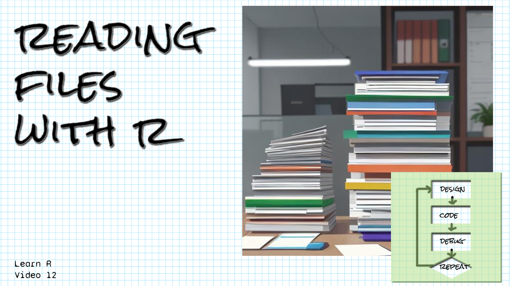

```{r setup, include=FALSE}
library(learnr)
library(gradethis)
library(tidyverse)
library(readxl)
knitr::opts_chunk$set(echo = FALSE)
```

## Welcome!

```{r fig.margin = TRUE, echo = FALSE, fig.width=3, out.width="100%", fig.align="right"}

```

*These exercises align with the [Design Code Debug Repeat](https://www.youtube.com/@DesignCodeDebugRepeat ) [Introductory R video 12 on reading data from files in R](https://youtu.be/fi7OqlYkuyk).*

*If you haven't already watched [the video](https://youtu.be/fi7OqlYkuyk), you might want to watch it first before trying these exercises.*

*Make sure you have the learnr, gradethis, tidyverse, and readxl packages installed.*

*Here are the sources for the data you'll be reading in:
[The apportionment table from census.gov is here.](https://www2.census.gov/programs-surveys/decennial/2020/data/apportionment/)

[The civil rights data was retrieved from here.](https://cirights.com/)
Mark, Skip and Cingranelli, David and Filippov, Mikhail and Richards, David L., The CIRIGHTS Data Project Scoring Manual V2.11.06.23 (November 6, 2023). Available at SSRN: https://ssrn.com/abstract=4625036 or http://dx.doi.org/10.2139/ssrn.4625036

[The brittleness data (with missing values) is from openmv.net.]
(https://openmv.net/info/brittleness-index)
*

## Simple read_csv

*Let's practice reading a csv file and naming the resulting tibble.  Please note that the files are in a directory called data/, so the names for files are given as "data/filename," and that is how you should type them in your code.*

Write the R code to read "data/cirights.csv" using read_csv and no arguments.  Store it in a variable called civil_rights, and have the code segment evaluate to civil_rights (have civil_rights be the last line of your code segment):

```{r simple_read_csv, exercise=TRUE}

```

``` {r simple_read_csv-hint-1}
Remember to name the tibble civil_rights, 
and make the last line of the code block civil_rights.
```

``` {r simple_read_csv-hint-2}
Remember to use <- to assign the result of read_csv 
to your tibble called civil_rights.
```


``` {r simple_read_csv-hint-3}
Use read_csv and pass in the file name, "data/cirights.csv".  
Make sure you put it in quotes!
```


``` {r simple_read_csv-solution}
civil_rights <- read_csv("data/cirights.csv")
civil_rights
```


``` {r simple_read_csv-check}
grade_result(
  pass_if(~ identical(.result$year[1], 1981), "You read it in correctly! "),
  fail_if(~TRUE, "Try looking at the hints! ")
)
  
```

## Reading "none" as an NA value.

*Let's practice reading unusual NA values. Please note that the files are in a directory called data/, so the names for files are given as "data/filename," and that is how you should type them in your code.*

Write a line of code to read "data/brittleness-index-none.csv" and store it in the variable brittleness.  Allow na values of the empty string "", "NA", and "none".  Make the tibble name brittleness the last line of your code.

```{r process_none_na, exercise=TRUE}


```


``` {r process_none_na-hint-1}
Remember to name the tibble brittleness, 
and make the last line of the code block brittleness
```

``` {r process_none_na-hint-2}
Remember to use <- to assign the result of read_csv 
to your tibble called brittleness
```


``` {r process_none_na-hint-3}
Use read_csv and pass in the file name, "data/brittleness-index-none.csv".  
Make sure you put it in quotes!
```

``` {r process_none_na-hint-4}
Set the na argument in read_csv to a vector of values 
that should be interpreted as missing data.
```


``` {r process_none_na-hint-5}
To create the vector of values for the na argument, 
use c=("", "NA", "none").
```


```{r process_none_na-solution}
brittleness <- read_csv("brittleness-index-none.csv", na = c("", "NA", "none"))
brittleness
```

``` {r process_none_na-check}
  grade_result(
    pass_if(~ is.na(.result$TK104[13]), "Well done! "),
    fail_if(~TRUE, "Try looking at the hints! ")
  )
```


## Read an xlsx file and skip rows at the top and the bottom of the file.

*Let's practice skipping lines! Please note that the files are in a directory called data/, so the names for files are given as "data/filename," and that is how you should type them in your code.*

Write a line of code to read "data/apportionment-2020-table01.xlsx" and store it in the variable apportionment.  Skip the first four lines of the file and read in the next 50 lines of data.  Change the column names to "State", "Apportionment_population", "Number_reps", and "Change".  Make the tibble name apportionment the last line of your code.

```{r skip_lines, exercise=TRUE}


```


``` {r skip_lines-hint-1}
Remember to name the tibble apportionment, 
and make the last line of the code block apportionment
```

``` {r skip_lines-hint-2}
Remember to use <- to assign the result of read_xlsx 
to your tibble called apportionment
```


``` {r skip_lines-hint-3}
Use read_xlsx and pass in the file name, "data/apportionment-2020-table01.xlsx".  
Make sure you put it in quotes!
```

``` {r skip_lines-hint-4}
Set the skip argument to 4.
```


``` {r skip_lines-hint-5}
Set the n_max argument to 50.
```


``` {r skip_lines-hint-6}
Set the col_names argument to c("State", "Apportionment_population", "Number_reps", "Change").
```


```{r skip_lines-solution}
apportionment <- read_xlsx("data/apportionment-2020-table01.xlsx", skip = 4, n_max = 50, col_names = c("State", "Apportionment_population", "Number_reps", "Change"))
apportionment
```

``` {r skip_lines-check}
  grade_result(
    pass_if(~ identical(.result$State[1], "Alabama"), "Well done! "),
    fail_if(~TRUE, "Try looking at the hints! ")
  )
```

