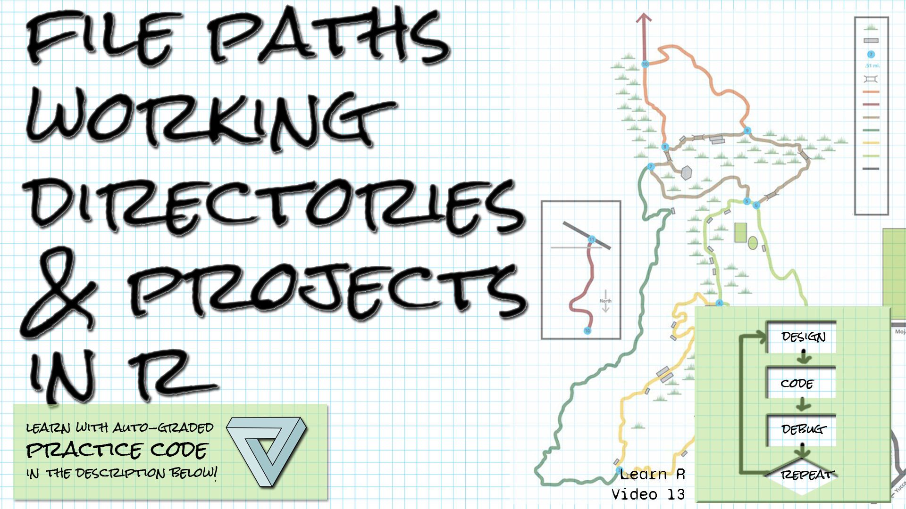

```{r setup, include=FALSE}
library(learnr)
library(gradethis)
library(tidyverse)
knitr::opts_chunk$set(echo = FALSE)
```

## Welcome!

```{r fig.margin = TRUE, echo = FALSE, fig.width=3, out.width="100%", fig.align="right"}

```


*These exercises align with the [Design Code Debug Repeat](https://www.youtube.com/@DesignCodeDebugRepeat ) [Introductory R video 13 on paths, directories, and projects in R](https://youtu.be/lJcuXBFP7Co).*

*If you haven't already watched [the video](https://youtu.be/lJcuXBFP7Co), you might want to watch it first before trying these exercises.*

*Here is the source for the data you'll be reading in: AI expenditures from 2017 to 2021, by category, from [Our World in Data](https://ourworldindata.org/artificial-intelligence)*

*Daniel Zhang, Nestor Maslej, Erik Brynjolfsson, John Etchemendy, Terah Lyons, James Manyika, Helen Ngo, Juan Carlos Niebles, Michael Sellitto, Ellie Sakhaee, Yoav Shoham, Jack Clark, and Raymond Perrault, “The AI Index 2022 Annual Report,” AI Index Steering Committee, Stanford Institute for Human-Centered AI, Stanford University, March 2022.*

## Getting and setting the working directory

*Let's practice with getwd() and setwd().*

Write the R code to get the working directory and store it in a variable called dir.  Then evaluate dir by typing dir:

```{r get_wd_exercise, exercise=TRUE}

```

``` {r get_wd_exercise-hint-1}
To get the current working directory, use getwd()
```

``` {r get_wd_exercise-hint-2}
Remember to have dir as the last line of your code.
```


``` {r get_wd_exercise-solution}
dir <- getwd()
dir
```


``` {r get_wd_exercise-check}
grade_this_code()
  
```

Do the same thing again (get the working directory and store in dir), but then append "/data" to
the end of the working directory and setwd to that directory.  (Use paste0 to paste the working
directory to "/data".)  Then getwd and store it in dir2.  The last line of the code block should 
be dir2.

```{r set_wd_exercise, exercise=TRUE}

```

``` {r set_wd_exercise-hint-1}
To get the current working directory, use getwd()
```

``` {r set_wd_exercise-hint-2}
To combine dir and "/data", use the code paste0(dir, "/data")
```


``` {r set_wd_exercise-hint-3}
You can just setwd to the result of your paste0 operation,
or you can store the result in a variable and pass that to setwd.
```


``` {r set_wd_exercise-solution}
dir <- getwd()
setwd(paste0(dir, "/data"))
dir2 <- getwd()
dir2
```


``` {r set_wd_exercise-check}
grade_result(
  pass_if(~ identical(.result,  paste0(getwd(),"/data")), "Well done! "),
  fail_if(~TRUE, "Try looking at the hints! ")
)
  
```


## Use file.path

*Let's practice with file.path.*

Write the R code to create a relative file path through the "data" folder to the file "AI_Data_2017.csv"
Store it in the variable path.  Then use read_csv to read the resulting path into a dataframe
called ai_2017.  Have the last line of your script be ai_2017.

```{r filepath1_exercise, exercise=TRUE}

```

``` {r filepath1_exercise-hint-1}
To use file.path, pass the components of the path in as arguments, in order, separated
by commas.  Remember to include the components in quotes (if they're not variables).
```

``` {r filepath1_exercise-hint-2}
You can then pass your variable containing the file path directly to read_csv.
```


``` {r filepath1_exercise-solution}
path <- file.path("data", "AI_Data_2017.csv")
ai_2017 <- read_csv(path)
ai_2017
```


``` {r filepath1_exercise-check}
grade_this_code()
  
```


Now write the R code to create a relative file path that goes up two parent directories to the
file "fake_file.csv".  Store the path in a variable called path.

```{r filepath2_exercise, exercise=TRUE}

```

``` {r filepath2_exercise-hint-1}
To go up a parent directory, use ".."
```

``` {r filepath2_exercise-hint-2}
If you're going to go up two parent directories, pass ".." as the first two parameters to
file.path, followed by the file name.
```


``` {r filepath2_exercise-solution}
path <- file.path("..", "..", "fake_file.csv")
```


``` {r filepath2_exercise-check}
grade_this_code()
  
```


