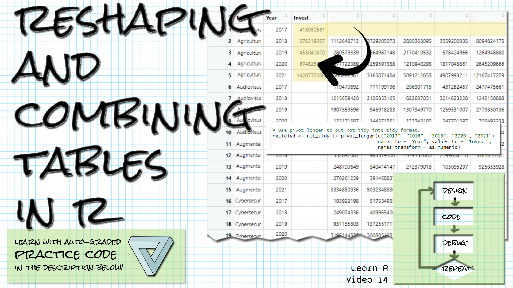

```{r setup, include=FALSE}
library(learnr)
library(gradethis)
library(tidyverse)
library(janitor)
library(readxl)
knitr::opts_chunk$set(echo = FALSE)
ai_data <- 
  read_csv("data/private-investment-in-artificial-intelligence-by-focus-area.csv",
           skip = 1,
           col_names = c("Entity", "Code", "Year", "Invest")) |> select(-Code)
ai_data_wider <- pivot_wider(ai_data, names_from = Year, values_from = Invest)
whr_2015 <- read_xlsx("data/WHR_2015.xlsx") 
whr_2016 <- read_xlsx("data/WHR_2016.xlsx") 
whr_2017 <- read_xlsx("data/WHR_2017.xlsx") 
```

## Welcome!

```{r fig.margin = TRUE, echo = FALSE, fig.width=3, out.width="100%", fig.align="right"}

```


*These exercises align with the [Design Code Debug Repeat](https://www.youtube.com/@DesignCodeDebugRepeat ) [Introductory R video 14 on reshaping data in R](https://youtu.be/_KT3NLpYcyk).*

*If you haven't already watched [the video](https://youtu.be/_KT3NLpYcyk), you might want to watch it first before trying these exercises.*

*Make sure you have the learnr, gradethis, tidyverse, readxl, and janitor packages installed.*

*Here is the source for the data you'll be reading in: AI expenditures from 2017 to 2021, by category, from [Our World in Data](https://ourworldindata.org/artificial-intelligence)*

*Daniel Zhang, Nestor Maslej, Erik Brynjolfsson, John Etchemendy, Terah Lyons, James Manyika, Helen Ngo, Juan Carlos Niebles, Michael Sellitto, Ellie Sakhaee, Yoav Shoham, Jack Clark, and Raymond Perrault, “The AI Index 2022 Annual Report,” AI Index Steering Committee, Stanford Institute for Human-Centered AI, Stanford University, March 2022.*

*And also the [World Happiness Report data](https://www.kaggle.com/datasets/unsdsn/world-happiness).*

## pivot_wider

*Let's practice with pivot_wider.  This is a way to reshape a table so that data in columns is moved up into the column names, combining observations in one row.*

The ai_data table has already been read in. 

```{r }
ai_data
```

Write the R code to reshape the table to a wider format, with the years as column names and the Invest values under the appropriate years.  Call the table not_tidy, and have the last line of your script be not_tidy

```{r pivot_wider_exercise, exercise=TRUE}

```

``` {r pivot_wider_exercise-hint-1}
Use pivot_wider with the data as the first argument (or pipe it in),
and use the names_from and values_from arguments.
```

``` {r pivot_wider_exercise-hint-2}
The names are coming from the Year column.
```

``` {r pivot_wider_exercise-hint-3}
The values are coming from the Invest column.
```


``` {r pivot_wider_exercise-hint-4}
Assign the result of pivot_wider to a table called not_tidy, and make sure
not_tidy is the last line of your script.
```


``` {r pivot_wider_exercise-solution}
not_tidy <- pivot_wider(ai_data, names_from = Year, values_from = Invest)
not_tidy
```


``` {r pivot_wider_exercise-check}
grade_result(
  pass_if(~ identical(.result$`2017`[1],  413050561), "Well done! "),
  fail_if(~TRUE, "Try looking at the hints! ")
)
  
```

## pivot_longer

*Let's practice with pivot_longer.  This function will help you tidy a table that is in a long format, but taking column names which should be data and moving them down into the table.*

Here's a wide version of the ai_data table, called ai_data_wider.

```{r }
ai_data_wider
```

Write the R code to reshape the table to a longer format, with a column called Year to hold the column names 2017 through 2021, and the values that are currently in those year columns in a new column called Invest. Call the table tidied, and have the last line of your script be tidied.  

Be sure to convert the Year column data to a numeric type.

```{r pivot_longer_exercise, exercise=TRUE}

```

``` {r pivot_longer_exercise-hint-1}
Use pivot_longer with the data as the first argument (or pipe it in).
The second argument is the columns that you want to bring down as data.
```

``` {r pivot_longer_exercise-hint-3}
You should use the names_to argument to give a name to
the column that will hold the old columns called 2017-2021, and
values_to for the name of the column to hold the values.
```

``` {r pivot_longer_exercise-hint-4}
Use names.transform to convert the years to numeric.
```


``` {r pivot_longer_exercise-hint-2}
You can specify the columns with c("2017", "2018", "2019", "2020", "2021")
```


``` {r pivot_longer_exercise-solution}
tidied <- not_tidy |> pivot_longer(c("2017", "2018", "2019", "2020", "2021"),
                                     names_to = "Year", values_to = "Invest",
                                     names_transform = as.numeric)
tidied
```


``` {r pivot_longer_exercise-check}
grade_result(
  pass_if(~ identical(.result$`Invest`[1],  413050561), "Well done! "),
  fail_if(~TRUE, "Try looking at the hints! ")
)
  
```


## intersect

*The intersect function will tell us the values that are in common in two vectors.  We can use colnames to get the names (variables) of a dataframe as a vector.*

Three tables have been read in called whr_2015, whr_2016, and whr_2017.  Write the R code to find the intersection of column names between whr_2016 and whr_2017.  (Do not store the result in a variable.)

```{r intersect_exercise, exercise=TRUE}

```

``` {r intersect_exercise-hint-1}
Invoke the intersect function and pass in the column names for whr_2016
and whr_2017 as arguments.
```


``` {r intersect_exercise-hint-2}
To get the column names for whr_2016, use colnames(whr_2016)
```

``` {r intersect_exercise-hint-3}
To get the column names for whr_2017, use colnames(whr_2017)
```

``` {r intersect_exercise-solution}
intersect(colnames(whr_2016), colnames(whr_2017))
```


``` {r intersect_exercise-check}
grade_result(
  pass_if(~ (length(.result) ==  4), "Well done! "),
  fail_if(~TRUE, "Try looking at the hints! ")
)
  
```


## clean_names

*The clean_names function from the janitor package will change the column names of a dataframe to consist of only the underscore character, numbers, and letters.*

Three tables have been read in called whr_2015, whr_2016, and whr_2017.  Write the R code to clean the names for each table.  Then intersect the column names of the whr_2016 and whr_2017 tables. (As in the last exercise).

```{r janitor_exercise, exercise=TRUE}

```

``` {r janitor_exercise-hint-1}
Pipe each table to the clean_names function or pass it as the first argument.
```


``` {r janitor_exercise-hint-2}
Assign the result of clean_names back to the original table.
```

``` {r janitor_exercise-hint-3}
For hints on intersect, look at the last exercise.
```

``` {r janitor_exercise-solution}
whr_2015 <- whr_2015 |> clean_names() 
whr_2016 <- whr_2016 |> clean_names() 
whr_2017 <- whr_2017 |> clean_names() 
intersect(colnames(whr_2016), colnames(whr_2017))
```


``` {r janitor_exercise-check}
grade_result(
  pass_if(~ (length(.result) ==  10), "Well done! "),
  fail_if(~TRUE, "Try looking at the hints! ")
)
  
```

## join tutorial

*There are several different join operations in the dplyr package of the tidyverse for combining tables in R.  Let's look at them.*

The code below creates two tables for the following examples.  These examples are from the [data wrangling cheat sheet](https://www.rstudio.com/wp-content/uploads/2015/02/data-wrangling-cheatsheet.pdf). 

These are tables a and b.
```{r}

a <- data.frame(x1 = c("A", "B", "C"), x2 = c(1, 2, 3))
b <- data.frame(x1 = c("A", "B", "D"), x2 = c(T, F, T))
a
b

```


For each example, notice which rows are retained, and where NA values appear.

We'll start with a left_join of a and b by x1.  
```{r}
left_join(a, b, by = "x1")
```

This is a right_join of a and b by x1.
```{r}
right_join(a, b, by = "x1")
```

This is an inner_join of a and b by x1.
```{r}
inner_join(a, b, by = "x1")
```

This is a full_join of a and b by x1.
```{r}
full_join(a, b, by = "x1")
```

This is a semi_join of a and b by x1.
```{r}
semi_join(a, b, by = "x1")
```

This is an anti_join of a and b by x1.
```{r}
anti_join(a, b, by = "x1")
```


## join exercise

*Let's use the correct join operation to combine our World Happiness Report tables.*

Now use the correct join to create a table composed of all columns and rows of whr_2015, whr_2016, and whr_2017.  The code for cleaning the names and adding a year column is at the top -- write your solution below that code.  Store the resulting table in whr_all, and then have whr_all as the last line of your script.
```{r join_exercise, exercise=TRUE}
whr_2015 <- whr_2015 |> clean_names() |> mutate(year = 2015)
whr_2016 <- whr_2016 |> clean_names() |> mutate(year = 2016)
whr_2017 <- whr_2017 |> clean_names() |> mutate(year = 2017)


```

``` {r join_exercise-hint-1}
You will need to use full_join to join the tables properly.
```


``` {r join_exercise-hint-2}
The full_join operation will take two parameters, so pass two tables to full_join,
and then either pipe the result to another full_join, or embed the full_join
within another full_join with the final table.
```

``` {r join_exercise-solution}
whr_2015 <- whr_2015 |> clean_names() |> mutate(year = 2015)
whr_2016 <- whr_2016 |> clean_names() |> mutate(year = 2016)
whr_2017 <- whr_2017 |> clean_names() |> mutate(year = 2017)

whr_all <- full_join(whr_2015, full_join(whr_2016, whr_2017))
whr_all
```


``` {r join_exercise-check}
grade_result(
  pass_if(~ (nrow(.result) ==  470), "Well done! "),
  fail_if(~TRUE, "Try looking at the hints! ")
)
  
```


