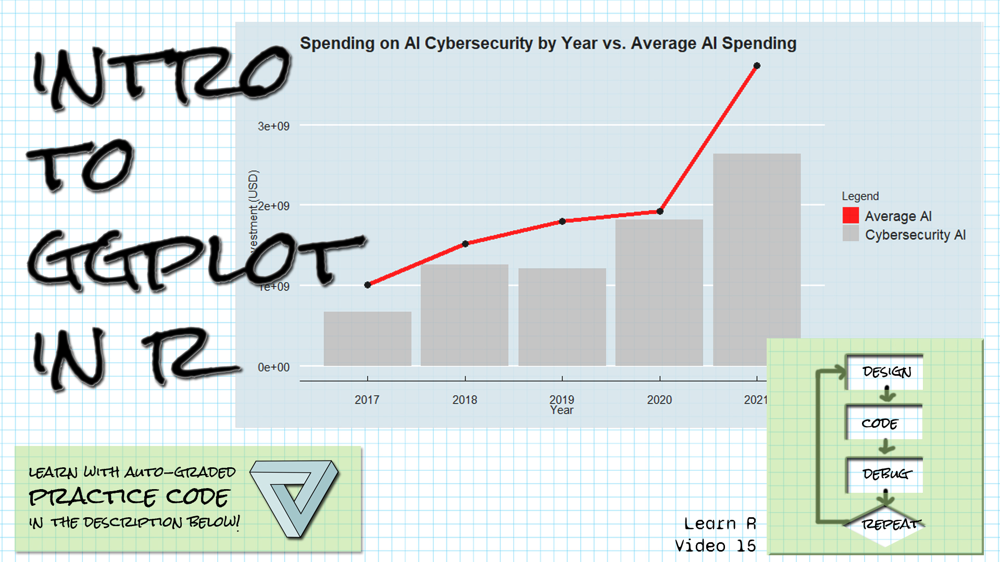

```{r setup, include=FALSE}
library(learnr)
library(gradethis)
library(tidyverse)

knitr::opts_chunk$set(echo = FALSE)
ai_data <- 
  read_csv("data/private-investment-in-artificial-intelligence-by-focus-area.csv",
           skip = 1,
           col_names = c("Entity", "Code", "Year", "Invest")) |> filter(Entity != "Total")
ai_cyber <- ai_data |> filter(Entity == "Cybersecurity, data protection")
avg_over_time <- ai_data |> group_by(Year) |> summarize(Average = mean(Invest))

```

## Welcome!

```{r fig.margin = TRUE, echo = FALSE, fig.width=3, out.width="100%", fig.align="right"}

```


*These exercises align with the [Design Code Debug Repeat](https://www.youtube.com/@DesignCodeDebugRepeat ) [Introductory R video 15 Introduction to ggplot]().*

*If you haven't already watched [the video](), you might want to watch it first before trying these exercises.*

*Make sure you have the learnr, gradethis, and the tidyverse packages installed.*

*Here is the source for the data we're working with:
[Our World in Data's artificial intelligence data](https://ourworldindata.org/artificial-intelligence)
Daniel Zhang, Nestor Maslej, Erik Brynjolfsson, John Etchemendy, Terah Lyons, 
James Manyika, Helen Ngo, Juan Carlos Niebles, Michael Sellitto, Ellie Sakhaee, 
Yoav Shoham, Jack Clark, and Raymond Perrault, “The AI Index 2022 Annual 
Report,” AI Index Steering Committee, Stanford Institute for Human-Centered AI, 
Stanford University, March 2022.
*


## Create a simple column chart

*The AI data has been read in to a table called ai_data, with column names "Entity", "Code", "Year", and "Invest".  The "Total" rows have been filtered out.*
*A table of just cybersecurity investment values has been created, called ai_cyber.*
*A summary table of averages over all spending by year has been created, called avg_over_time.*
*The ggplot function takes, as its first parameter, the dataframe that contains the data for the plot.  As its second parameter, it takes the aesthetic mapping, describing through parameters how the data will be mapped to aesthetic elements of the plot.  Use the aes function to create the aesthetic mapping.*

Create a column chart of the ai_cyber table with a column for each year in the table, with the amount invested represented as the column heights.  Do not store this in a variable or add anything else to your script.  This will be graded on the code exactly matching the solution code, so it's possible you'll create the correct plot in a different way from the solution.  Compare your plot visually to the plot here:

```{r fig.margin = TRUE, echo = FALSE, fig.width=3, out.width="100%", fig.align="right"}
knitr::include_graphics("images/plot1.jpg")
```


```{r simple_column, exercise=TRUE}


```

``` {r simple_column-hint-1}
Put the data and mapping arguments in the call to ggplot.
```

``` {r simple_column-hint-2}
The data is the ai_cyber table. 
```


``` {r simple_column-hint-3}
Use aes for the mapping argument.  Use the x and y aesthetics.
```


``` {r simple_column-hint-4}
The x axis should be Year, and the y axis should be Invest.
```


``` {r simple_column-hint-5}
Add geom_col to your ggplot object with no arguments.
```


``` {r simple_column-solution}

ggplot(ai_cyber, aes(x = Year, y=Invest)) + geom_col() 

```


``` {r simple_column-check}
   grade_this_code()
```


## Add labels to a plot

*The AI data has been read in to a table called ai_data, with column names "Entity", "Code", "Year", and "Invest".  The "Total" rows have been filtered out.*
*A table of just cybersecurity investment values has been created, called ai_cyber.*
*A summary table of averages over all spending by year has been created, called avg_over_time.*
*The labs function allows you to add labels for the aesthetics in your plot as well as additional labels such as title and subtitle.*

Add the following labels to the plot (provided):
A title that is "Cyber Investment in AI"
An x axis label that is "Investment Year"
A y axis label that is "Investment in US Dollars"
This will be graded on the code exactly matching the solution code, so it's possible you'll create the correct plot in a different way from the solution.  Compare your plot visually to the plot here:

```{r fig.margin = TRUE, echo = FALSE, fig.width=3, out.width="100%", fig.align="right"}
knitr::include_graphics("images/plot2.jpg")
```


```{r labels, exercise=TRUE}
ggplot(ai_cyber, aes(x = Year, y=Invest)) + geom_col() 

```

``` {r labels-hint-1}
Add + labs() to the given code.
```

``` {r labels-hint-2}
You'll include the text given for the title, x axis, and y axis, like this:
title = "Cyber Investment in AI" (etc.)
```


``` {r labels-solution}

ggplot(ai_cyber, aes(x = Year, y=Invest)) + geom_col() +
  labs(title = "Cyber Investment in AI", x = "Investment Year", y ="Investment in US Dollars" )

```


``` {r labels-check}
   grade_this_code()
```


## Add a theme

*The AI data has been read in to a table called ai_data, with column names "Entity", "Code", "Year", and "Invest".  The "Total" rows have been filtered out.*
*A table of just cybersecurity investment values has been created, called ai_cyber.*
*Themes define the appearance of a plot, and can include such elements as background color, font, and positioning of labels.*

Add the theme_dark() layer from ggplot2 to the plot.
This will be graded on the code exactly matching the solution code, so it's possible you'll create the correct plot in a different way from the solution.  Compare your plot visually to the plot here:

```{r fig.margin = TRUE, echo = FALSE, fig.width=3, out.width="100%", fig.align="right"}
knitr::include_graphics("images/plot3.jpg")
```


```{r theme, exercise=TRUE}
ggplot(ai_cyber, aes(x = Year, y=Invest)) + geom_col() +
  labs(title = "Cyber Investment in AI", 
       x = "Investment Year", 
       y ="Investment in US Dollars" )

```

``` {r theme-hint-1}
Remember, use + to add a layer to the plot.
```

``` {r theme-hint-2}
This layer is called theme_dark() and takes no arguments.
```


``` {r theme-solution}

ggplot(ai_cyber, aes(x = Year, y=Invest)) + geom_col() +
  labs(title = "Cyber Investment in AI", 
       x = "Investment Year", 
       y ="Investment in US Dollars" ) + theme_dark()
  

```


``` {r theme-check}
   grade_this_code()
```


## Add a second layer with new data

*The AI data has been read in to a table called ai_data, with column names "Entity", "Code", "Year", and "Invest".  The "Total" rows have been filtered out.*
*A table of just cybersecurity investment values has been created, called ai_cyber.*
*A summary table of averages over all spending by year has been created, called avg_over_time.*
*If you put the data and aes arguments in the ggplot function, then they are global, and impact the entire ggplot.  If you put them within the parentheses for a geom, they will be local and will apply only to that geom.*

Add a line plot to the code below after geom_col().  The line plot should use the avg_over_time data set, which has columns Year and Average.  Make the line red with a size of two.
There are a few peculiarities with the grading.  Explicitly set mapping equal to the aes function -- don't just include it as the second parameter, and spell "colour" the British way!
This will be graded on the code exactly matching the solution code, so it's possible you'll create the correct plot in a different way from the solution.  Compare your plot visually to the plot here:

```{r fig.margin = TRUE, echo = FALSE, fig.width=3, out.width="100%", fig.align="right"}
knitr::include_graphics("images/plot4.jpg")
```


```{r add_line, exercise=TRUE}
ggplot(ai_cyber, aes(x = Year, y=Invest)) + geom_col() +
  labs(title = "Cyber Investment in AI", 
       x = "Investment Year", 
       y ="Investment in US Dollars" ) + theme_dark()

```

``` {r add_line-hint-1}
Remember, use + to add a layer to the plot.
```

``` {r add_line-hint-2}
Use geom_line to add the layer.
```


``` {r add_line-hint-3}
The data for geom_line is different from the global data.  Use avg_over_time for
the data argument.  Use mapping = aes(x = Year, y = Average) for the mapping.
```


``` {r add_line-hint-4}
The color and size arguments do not go in the aes function because you will be
using fixed values, "red" and 2, for the colour and size.  You won't be mapping
the data to those variables.  So put them outside of the aes function.
(Remember to use colour for color.)
```


``` {r add_line-solution}

ggplot(ai_cyber, aes(x = Year, y=Invest)) + geom_col() +
  geom_line(avg_over_time, mapping=aes(x = Year, y = Average), color = "red", size = 2) +
  labs(title = "Cyber Investment in AI", 
       x = "Investment Year", 
       y ="Investment in US Dollars" ) + theme_dark()
  

```


``` {r add_line-check}
   grade_this_code()
```


## Add a legend

*The AI data has been read in to a table called ai_data, with column names "Entity", "Code", "Year", and "Invest".  The "Total" rows have been filtered out.*
*A table of just cybersecurity investment values has been created, called ai_cyber.*
*A summary table of averages over all spending by year has been created, called avg_over_time.*
*To create a legend, use a scale_ function, such as scale_(aesthetic)_manual.*

Add a legend to the plot using scale_fill_manual.  Include the values and name (do not include labels as in the video).  The name should be "Legend". You will need to make some changes to the code below to add aesthetics and labels for fill.
This will be graded on the code exactly matching the solution code, so it's possible you'll create the correct plot in a different way from the solution.  Compare your plot visually to the plot here:

```{r fig.margin = TRUE, echo = FALSE, fig.width=3, out.width="100%", fig.align="right"}
knitr::include_graphics("images/plot5.jpg")
```


```{r legend, exercise=TRUE}
ggplot(ai_cyber, aes(x = Year, y=Invest)) + geom_col() +
  geom_line(avg_over_time, mapping=aes(x = Year, y = Average), color = "red", size = 2) +
  labs(title = "Cyber Investment in AI", 
       x = "Investment Year", 
       y ="Investment in US Dollars" ) + theme_dark()

```

``` {r legend-hint-1}
Remember, use + to add a layer to the plot.
```

``` {r legend-hint-2}
Add an aes to geom_col with fill = "Invest".
Add fill = "Avg" to the aes for geom_line.
```


``` {r legend-hint-3}
Add scale_fill_manual with argument name = "Legend" and values equal to
a vector of "Invest" = "grey", and "Avg" = "red"
```


``` {r legend-solution}

ggplot(ai_cyber, aes(x = Year, y=Invest)) + geom_col(aes(fill = "Invest")) +
  geom_line(avg_over_time, mapping=aes(x = Year, y = Average, fill="Avg"), color = "red", size = 2) +
  labs(title = "Cyber Investment in AI", 
       x = "Investment Year", 
       y ="Investment in US Dollars" ) + theme_dark() +
  scale_fill_manual(name = "Legend", values = c("Invest" = "grey", "Avg" = "red"))
  

```


``` {r legend-check}
   grade_this_code()
```

