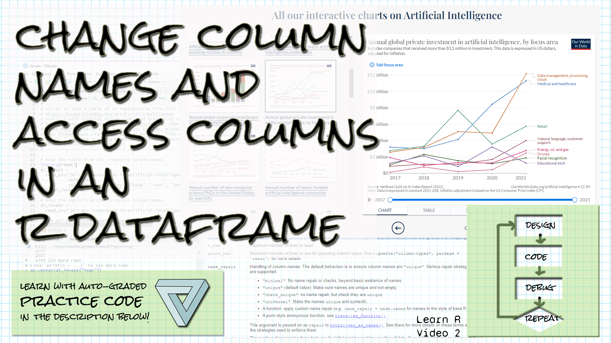

```{r setup, include=FALSE}
library(learnr)
library(gradethis)
library(readr)
knitr::opts_chunk$set(echo = FALSE)


```

## Welcome!

```{r fig.margin = TRUE, echo = FALSE, fig.width=3, out.width="100%", fig.align="right"}

```


*These exercises align with the [Design Code Debug Repeat](https://www.youtube.com/@DesignCodeDebugRepeat ) [Introductory R video 2 on columns in R](https://youtu.be/LJpno-AXFuU).*

*If you haven't already watched [the video](https://youtu.be/LJpno-AXFuU), you might want to watch it first before trying these exercises.*

*Make sure you have the learnr, gradethis, and readr packages installed.*

*Here is the source for the data we're working with:
[Our World in Data's artificial intelligence data](https://ourworldindata.org/artificial-intelligence)
Daniel Zhang, Nestor Maslej, Erik Brynjolfsson, John Etchemendy, Terah Lyons, 
James Manyika, Helen Ngo, Juan Carlos Niebles, Michael Sellitto, Ellie Sakhaee, 
Yoav Shoham, Jack Clark, and Raymond Perrault, “The AI Index 2022 Annual 
Report,” AI Index Steering Committee, Stanford Institute for Human-Centered AI, 
Stanford University, March 2022.
*

## Changing column names with read_csv

*The read_csv function has several parameters that allow us to control how we read a table in.  The col_names parameter will allow us to set the column names, and the skip parameter will allow us to skip lines.*

Below is the line of code that reads in the AI investment table.  Add the col_names and skip parameters so we can read in the table with the column names "Entity", "Code", "Year", and "Invest".  To do this, you'll have to also skip reading in the first line of the file, because that line contains column names and we don't want to read it as data.  Make ai_invest the last line of your script (it's already there -- just leave it).


```{r read_new_col_names, exercise=TRUE}
ai_invest <- read_csv("data/private-investment-in-artificial-intelligence-by-focus-area.csv")
ai_invest
```

``` {r read_new_col_names-hint-1}
Inside the parentheses, after the file name, include the new named parameters
and their values, separated by commas.  
```

``` {r read_new_col_names-hint-2}
For the skip parameter, put a comma after the file name and then write
skip = 1
```


``` {r read_new_col_names-hint-3}
For the col_names parameter, pass in 
col_names = c("Entity", "Code", "Year", "Invest")
```


``` {r read_new_col_names-solution}
ai_invest <- read_csv("data/private-investment-in-artificial-intelligence-by-focus-area.csv", col_names = c("Entity", "Code", "Year", "Invest"), skip = 1)
ai_invest
```


``` {r read_new_col_names-check}
grade_result(
  pass_if(~ (colnames(.result) == c("Entity", "Code", "Year", "Invest")), "Well done! "),
  fail_if(~TRUE, "Try looking at the hints! ")
)
```

## Changing column names by assigning to colnames

*If you already have a table and you want to change the column names, you can assign directly to colnames(your table).*

Below is the line of code that reads in the AI investment table.  Change the column names by assigning the names "Area", "Code", "Year", "Invest_Amount" to the dataframe using colnames.  The names are provided to make the exercise easier.  Leave ai_invest as the last line of the script.


```{r change_colnames_1, exercise=TRUE}
ai_invest <- read_csv("data/private-investment-in-artificial-intelligence-by-focus-area.csv")
# "Area", "Code", "Year", "Invest_Amount"
ai_invest
```

``` {r change_colnames_1-hint-1}
Write colnames(ai_invest) on the left of your assignment statement.  
```

``` {r change_colnames_1-hint-2}
Remember to use c to create a vector of column names using the values given.
```

``` {r change_colnames_1-solution}
ai_invest <- read_csv("data/private-investment-in-artificial-intelligence-by-focus-area.csv")
colnames(ai_invest) <- c("Area", "Code", "Year", "Invest_Amount")
ai_invest
```


``` {r change_colnames_1-check}
grade_result(
  pass_if(~ (colnames(.result) == c("Area", "Code", "Year", "Invest_Amount")), "Well done! "),
  fail_if(~TRUE, "Try looking at the hints! ")
)
```


## Changing column names by assigning one new value to colnames

*If you already have a table and you want to change only one column name, you can index into colnames(your table) to change the one name.  We index into a vector using [] with the index inside the brackets.*

Below is the line of code that reads in the AI investment table.  Change the column name for the last column to "Invest" by indexing into colnames and assigning directly to that index.  This code will be graded based on how you write the code, not the result.


```{r change_colnames_2, exercise=TRUE}
ai_invest <- read_csv("data/private-investment-in-artificial-intelligence-by-focus-area.csv")

```

``` {r change_colnames_2-hint-1}
Write colnames(ai_invest)[4] on the left of your assignment statement.  
```

``` {r change_colnames_2-hint-2}
You only need to assign "Invest" to that!
```

``` {r change_colnames_2-solution}
ai_invest <- read_csv("data/private-investment-in-artificial-intelligence-by-focus-area.csv")
colnames(ai_invest)[4] <- "Invest"
```


``` {r change_colnames_2-check}
grade_this_code()
```


## A few questions...

We talked about a few other things in the video.  Answer the questions below to test your knowledge.

```{r quiz}
quiz(
  question("What command do I use to see the name, type, and information about the columns and size of a dataframe?",
    answer("str() with the dataframe name in parentheses", correct = TRUE),
    answer("View() with the dataframe name in ()"),
    answer("? followed by the dataframe name"),
    answer("colnames() with the dataframe name in parentheses")
  ),
  question("What command do I use to see the full dataframe in a new tab?",
    answer("str() with the dataframe name in parentheses"),
    answer("View() with the dataframe name in ()", correct = TRUE),
    answer("? followed by the dataframe name"),
    answer("paste() with the dataframe name in parentheses")
  ),
  question("What command do I use to get the vector of a dataframe's column names?",
    answer("str() with the dataframe name in parentheses"),
    answer("View() with the dataframe name in ()"),
    answer("? followed by the dataframe name"),
    answer("colnames() with the dataframe name in parentheses", correct = TRUE)
  ),
  question("Which of the following ways of accessing the Year column in the AI dataframe returns a table, not a vector?",
    answer("ai_invest[[3]]"),
    answer("ai_invest$Year"),
    answer("as.vector(ai_invest[,3])"),
    answer("ai_invest[&#34;Year&#34;]", correct = TRUE)
  )
)

```

