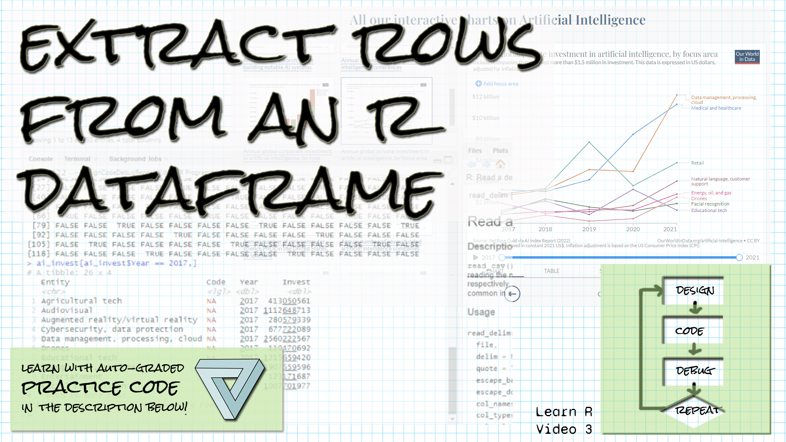

```{r setup, include=FALSE}
library(learnr)
library(gradethis)
library(readr)
knitr::opts_chunk$set(echo = FALSE)
ai_invest <- read_csv("data/private-investment-in-artificial-intelligence-by-focus-area.csv", skip = 1, col_names = c("Entity", "Code", "Year", "Invest"))

```

## Welcome!

```{r fig.margin = TRUE, echo = FALSE, fig.width=3, out.width="100%", fig.align="right"}

```


*These exercises align with the [Design Code Debug Repeat](https://www.youtube.com/@DesignCodeDebugRepeat ) [Introductory R video 3 on rows in an R dataframe](https://youtu.be/etFZvjfxrmw).*

*If you haven't already watched [the video](https://youtu.be/etFZvjfxrmw), you might want to watch it first before trying these exercises.*

*Make sure you have the learnr, gradethis, and readr packages installed.*

*Here is the source for the data we're working with:
[Our World in Data's artificial intelligence data](https://ourworldindata.org/artificial-intelligence)
Daniel Zhang, Nestor Maslej, Erik Brynjolfsson, John Etchemendy, Terah Lyons, 
James Manyika, Helen Ngo, Juan Carlos Niebles, Michael Sellitto, Ellie Sakhaee, 
Yoav Shoham, Jack Clark, and Raymond Perrault, “The AI Index 2022 Annual 
Report,” AI Index Steering Committee, Stanford Institute for Human-Centered AI, 
Stanford University, March 2022.
*

## Accessing an individual row (subsetting a dataframe) with indexing

*You can access an individual row in a dataframe by using indexing, giving the row (or subset of rows) as the first value, a comma, and then nothing if you want all columns, or you can optionally subset columns as well.*

The ai_invest dataframe has been read in with column names "Entity", "Code", "Year", and "Invest".  Access row five of the dataframe using indexing.  


```{r access_row_5, exercise=TRUE}

```

``` {r access_row_5-hint-1}
Use the name of the dataframe and then square brackets. 
```

``` {r access_row_5-hint-2}
In the square brackets, put the name of the row you want and then a comma.
```


``` {r access_row_5-solution}
ai_invest[5,]
```


``` {r access_row_5-check}
grade_result(
  pass_if(~ (.result[[4]]==1428772088), "Well done! "),
  fail_if(~TRUE, "Try looking at the hints! ")
)
```


## Subsetting multiple rows with indexing

*You can access an individual row in a dataframe by using a subset of rows as the first value, a comma, and then nothing if you want all columns, or you can optionally subset columns as well.*

The ai_invest dataframe has been read in with column names "Entity", "Code", "Year", and "Invest".  Access the first five rows of the dataframe using indexing and the sequence operator :.  This exercise will be graded based on your code, not the result. 


```{r access_5_rows, exercise=TRUE}

```

``` {r access_5_rows-hint-1}
Use the name of the dataframe and then square brackets. 
```

``` {r access_5_rows-hint-2}
In the square brackets, put the name of the row you want and then a comma.
```


``` {r access_5_rows-solution}
ai_invest[1:5,]
```


``` {r access_5_rows-check}
grade_this_code()
```

Now subset the dataframe by extracting rows 1,2,5,and 9.  Create a vector of these values using concatenate as your indexing argument.  This exercise will be graded based on your code, not the result.


```{r access_4_rows, exercise=TRUE}

```

``` {r access_4_rows-hint-1}
Use the name of the dataframe and then square brackets. 
```

``` {r access_4_rows-hint-2}
In the square brackets, use c to create a vector of the rows you want to extract.
Don't forget the comma after the rows to indicate you want all columns.
```


``` {r access_4_rows-solution}
ai_invest[c(1, 2, 5, 9),]
```


``` {r access_4_rows-check}
grade_this_code()
```

## Subsetting with logic

*You can subset rows in a dataframe with a logical condition by putting the logical condition in brackets, follow by a comma.*

The ai_invest dataframe has been read in with column names "Entity", "Code", "Year", and "Invest".  Subset the dataframe to include only rows for the year 2021.  Do not assign the result to a variable, or if you do, make the variable name the last line of the script.


```{r access_2021, exercise=TRUE}

```

``` {r access_2021-hint-1}
Use the name of the dataframe and then square brackets. 
```

``` {r access_2021-hint-2}
In the square brackets, put the logical condition and then a comma.
```


``` {r access_2021-hint-3}
You will want to compare the Year variable to 2021 using ==
To access the Year variable, use ai_invest$Year
```


``` {r access_2021-solution}
ai_invest[ai_invest$Year == 2021,]
```


``` {r access_2021-check}
grade_result(
  pass_if(~ (nrow(.result)==26 & .result$Year[1]==2021), "Well done! "),
  fail_if(~TRUE, "Try looking at the hints! ")
)
```


## Binding tables together

*You can stack dataframes together into one dataframe using rbind, so long as the dataframes have the same columns.*

The ai_invest dataframe has been read in with column names "Entity", "Code", "Year", and "Invest". The following script subsets two categories of investment, Drones and Entertainment, into the tables drones and entertainment.  Combine the tables with rbind with drones first and entertainment second.  Do not store the result in a variable, or if you do, make the variable name the last line of your script.


```{r binding, exercise=TRUE}
drones <- ai_invest[ai_invest$Entity == "Drones",]
entertainment <- ai_invest[ai_invest$Entity == "Entertainment",]


```

``` {r binding-hint-1}
Use rbind and pass in as arguments the names of the two tables, 
in the order you want them combined.
```


``` {r binding-solution}
drones <- ai_invest[ai_invest$Entity == "Drones",]
entertainment <- ai_invest[ai_invest$Entity == "Entertainment",]
rbind(drones, entertainment)
```


``` {r binding-check}
grade_result(
  pass_if(~ (nrow(.result)==10 & .result$Entity[1]=="Drones"), "Well done! "),
  fail_if(~TRUE, "Try looking at the hints! ")
)
```


## A couple of questions...

We talked about a couple of other things in the video.  Answer the questions below to test your knowledge.

```{r quiz}
quiz(
  question("Which line of code will subset rows 1 through 5 and columns 1, 2, and 4 from ai_invest?",
    answer("ai_invest[1,5]$c(1, 2, 4)"),
    answer("ai_invest[1:5, c(1, 2, 4)]", correct = TRUE),
    answer("ai_invest[1,2,3,4,5, c(1, 2, 4)]"),
    answer("ai_invest[1:5, 1:4]")
  ),
  question("If I want to select all but column 2 from ai_invest, how can I do it?",
    answer("ai_invest$Entity,Year,Invest"),
    answer("ai_invest[,-2]", correct = TRUE),
    answer("ai_invest[,c(1,3,4)]", correct = TRUE),
    answer("ai_invest[1,3,4]")
  )
)

```

