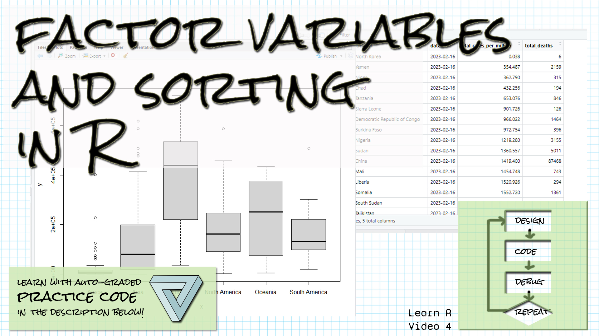

```{r setup, include=FALSE}
library(readr)
library(learnr)
library(gradethis)
knitr::opts_chunk$set(echo = FALSE)

covid_feb16_data <- read_csv("data/COVID_Feb16_Data.csv", 
                            col_types = cols(continent = col_factor(levels = 
                            c("Africa", "Asia", "Europe", "North America", 
                               "Oceania", "South America"))))
```

## Welcome!

```{r fig.margin = TRUE, echo = FALSE, fig.width=3, out.width="100%", fig.align="right"}

```


*These exercises align with the [Design Code Debug Repeat](https://www.youtube.com/@DesignCodeDebugRepeat ) [Introductory R video 4 on factors and sorting](https://youtu.be/me0ZImqfvzc).*

*If you haven't already watched [the video](https://youtu.be/me0ZImqfvzc), you might want to watch it first before trying these exercises.*

*Make sure you have the learnr, readr, and gradethis packages installed.*

## Factors
*Factors are a way to store categorical data in R.  A factor has levels, which is the different values the variables can hold.  The variables are stored as the number of the level, rather than as characters, which is more efficient.*

A subset of the COVID dataframe has been read in, called covid_feb16_data.  It consists of only the February 16 rows and the following columns:  continent, location, date, total_cases_per_million, and total_deaths.  The continent variable has been read in as a factor.  Show the levels of the continent variable.


```{r levels, exercise=TRUE}

```

``` {r levels-hint-1}
To get the levels, use the levels function and pass in the column name 
as an argument.
```

``` {r levels-hint-2}
The name of the column is covid_feb16_data$continent
```


``` {r levels-solution}
levels(covid_feb16_data$continent)
```


``` {r levels-check}
grade_result(
  pass_if(~ (.result[[1]]=="Africa"), "Well done! "),
  fail_if(~TRUE, "Try looking at the hints! ")
)
```


## Ordering a dataframe by a column
*R has sort and order functions that allow you to sort a vector.  The sort function sorts the values and returns them.  The order function sorts the values and returns the indices of the values, allowing you to sort an entire dataframe by one column by indexing into it with the ordered indices.*

A subset of the COVID dataframe has been read in, called covid_feb16_data.  It consists of only the February 16 rows and the following columns:  continent, location, date, total_cases_per_million, and total_deaths.  Order the dataframe by the total_deaths column.  Do not store the result in a variable.


```{r order, exercise=TRUE}

```

``` {r order-hint-1}
You are going to index into the covid_feb16_data dataframe
using the vector of ordered indices for the rows and then a comma,
for all columns.
```

``` {r order-hint-2}
To get the ordered indices of rows, use order and pass the
total_deaths column as a parameter.
```


``` {r order-solution}
covid_feb16_data[order(covid_feb16_data$total_deaths),]
```


``` {r order-check}
grade_result(
  pass_if(~ (.result$location[[1]]=="Nauru"), "Well done! "),
  fail_if(~TRUE, "Try looking at the hints! ")
)
```


