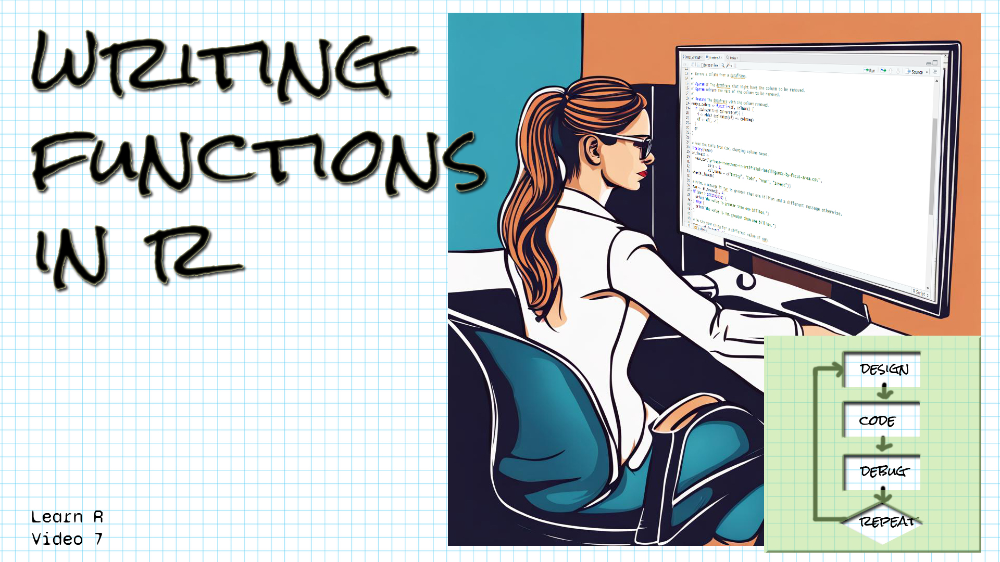

```{r setup, include=FALSE}
library(learnr)
library(gradethis)
library(readr)
knitr::opts_chunk$set(echo = FALSE)
ai_2020 <- read_csv("data/AI_Data_2020.csv")
ai_2021 <- read_csv("data/AI_Data_2021.csv")

```

## Welcome!

```{r fig.margin = TRUE, echo = FALSE, fig.width=3, out.width="100%", fig.align="right"}

```


*These exercises align with the [Design Code Debug Repeat](https://www.youtube.com/@DesignCodeDebugRepeat ) [Introductory R video 7 on functions in R](https://youtu.be/v7A_4Wi2Y4Q).*

*If you haven't already watched [the video](https://youtu.be/v7A_4Wi2Y4Q), you might want to watch it first before trying these exercises.*

*Make sure you have the learnr, gradethis, tidyverse, and readr packages installed.*

*Here is the source for the data we're working with:
[Our World in Data's artificial intelligence data](https://ourworldindata.org/artificial-intelligence)
Daniel Zhang, Nestor Maslej, Erik Brynjolfsson, John Etchemendy, Terah Lyons, 
James Manyika, Helen Ngo, Juan Carlos Niebles, Michael Sellitto, Ellie Sakhaee, 
Yoav Shoham, Jack Clark, and Raymond Perrault, “The AI Index 2022 Annual 
Report,” AI Index Steering Committee, Stanford Institute for Human-Centered AI, 
Stanford University, March 2022.

I have extracted the data into two tables for the years 2020 and 2021.
*

## Simple function

*Let's warm up by writing a function that takes two values as parameters, adds them together, and evaluates to the result.*

Write a function called add_two that takes two parameters called a and b, adds them together and stores
the result in c, and then evaluates to c.  Remember that a function evaluates to whatever its last line is.
You should then call the function with 1 and 2, 100 and 200, and 4 and 6.


```{r simple_function, exercise=TRUE}


```

``` {r simple_function-hint-1}
To define a function, we write function_name <- function().
So for our function, that's 
add_two <- function(a, b)
```

``` {r simple_function-hint-2}
After our function header, we should have an open curly brace,
followed by the body of the function, followed by a close curly brace.
```


``` {r simple_function-hint-3}
The body of our function should add a and b and store the result in c,
then be simply
c
```


``` {r simple_function-solution}
add_two <- function(a, b) {
  c <- a + b
  c
}
add_two(1, 2)
add_two(100, 200)
add_two(4, 6)

```


``` {r simple_function-check}
   grade_this_code()
```


## Function with a dataframe parameter

*Let's write a function that's a little more interesting!  We'll write a function that takes a dataframe as a parameter, and removes the "Code" column from the dataframe.  The ai_2021 dataframe has a column called "Code" that we can remove.*

Write a function called remove_column that takes a dataframe parameter called df.  It should remove the 
"Code" column from df and then evaluate to df.  Invoke the function with ai_2021 as a parameter.


```{r df_function, exercise=TRUE}


```

``` {r df_function-hint-1}
To define a function, we write function_name <- function().
So for our function, that's 
remove_column <- function(df)
```

``` {r df_function-hint-2}
After our function header, we should have an open curly brace,
followed by the body of the function, followed by a close curly brace.
```


``` {r df_function-hint-3}
The body of our function should find the index of the "Code" column in
df using which.  It should then remove the column, and the final line should be
df
```

``` {r df_function-hint-4}
To find the index of the "Code" column, write
i <- which (colnames(df) == "Code")
```


``` {r df_function-hint-5}
To remove the "code" column, write
df <- df[, -i]
```


``` {r df_function-solution}
remove_column <- function(df) {
   i <- which (colnames(df) == "Code")
   df <- df[, -i]
   df
}
remove_column(ai_2021)

```


``` {r df_function-check}
   grade_result(
    pass_if(~ identical(.result[[1,2]], 2021 ), "Well done! "),
    fail_if(~TRUE, "Try looking at the hints! ")
  )


```

## Function documentation

*Before we make our function more general, let's review how we document a function with
some multiple-choice questions.*


```{r quiz}
quiz(
  question("What symbol do we put before each line of the ROxygen comment above a function?",
    answer("#*"),
    answer("%"),
    answer("#'", correct = TRUE),
    answer("<-")
  ),
  question("In our remove_column function, what would we comment with the tag @param?",
    answer("df", correct = TRUE),
    answer("i"),
    answer("remove_column"),
    answer("ai_2020")
  ),
    question("In our add_two function, what would we comment with the tag @returns?",
    answer("The sum of a and b", correct = TRUE),
    answer("a"),
    answer("b"),
    answer("add_two")
  )
)
```


## More general function

*Let's make our remove_column function more general and more error-proof.  We'll have it take both the dataframe and the name of the column to be removed, and it should check that the column is in the dataframe before attempting to remove it.*

Write a function called remove_column that takes a dataframe parameter called df and the name of a column called colname.  It should then check if the column is in the dataframe, and if it is, it should
get the index of the column and remove it.  It should then evaluate to the dataframe with the column removed.  Invoke the function with first ai_2020 and "Code", and then ai_2021 and "Year".


```{r general_function, exercise=TRUE}


```

``` {r general_function-hint-1}
To define a function, we write function_name <- function().
So for our function, that's 
remove_column <- function(df, colname)
```

``` {r general_function-hint-2}
After our function header, we should have an open curly brace,
followed by the body of the function, followed by a close curly brace.
```


``` {r general_function-hint-3}
The body of our function should check if the colname column is in the df, and if it is,
find the index of the colname column in df using which.  
It should then remove the column, and the final line should be
df
```

``` {r general_function-hint-4}
To check if colname is in the df, write
if (colname %in% colnames(df))
```


``` {r general_function-hint-5}
To find the index of the colname column, write
i <- which (colnames(df) == colname)
```


``` {r general_function-hint-6}
To remove the "code" column, write
df <- df[, -i]
```


``` {r general_function-solution}
remove_column <- function(df, colname) {
  if (colname %in% colnames(df)) {
    i <- which (colnames(df) == colname)
    df <- df[, -i]
  }
  df
}
remove_column(ai_2020, "Code")
remove_column(ai_2021, "Year")

```


``` {r general_function-check}
   grade_result(
    pass_if(~ identical(.result[[1,3]], 1428772088 ), "Well done! "),
    fail_if(~TRUE, "Try looking at the hints! ")
  )


```
