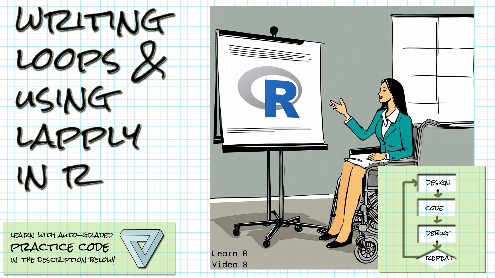

```{r setup, include=FALSE}
library(learnr)
library(gradethis)
library(readr)
knitr::opts_chunk$set(echo = FALSE)
```

## Welcome!

```{r fig.margin = TRUE, echo = FALSE, fig.width=3, out.width="100%", fig.align="right"}

```


*These exercises align with the [Design Code Debug Repeat](https://www.youtube.com/@DesignCodeDebugRepeat) [Introductory R video 8 on loops and lapply in R](https://youtu.be/t7BROhh_Khc).*

*If you haven't already watched [the video](https://youtu.be/t7BROhh_Khc), you might want to watch it first before trying these exercises.*

*Make sure you have the learnr, gradethis, and the readr packages installed.*

*Here is the source for the data you'll be reading in: AI expenditures from 2017 to 2021, by category, from [Our World in Data](https://ourworldindata.org/artificial-intelligence)*

*Daniel Zhang, Nestor Maslej, Erik Brynjolfsson, John Etchemendy, Terah Lyons, James Manyika, Helen Ngo, Juan Carlos Niebles, Michael Sellitto, Ellie Sakhaee, Yoav Shoham, Jack Clark, and Raymond Perrault, “The AI Index 2022 Annual Report,” AI Index Steering Committee, Stanford Institute for Human-Centered AI, Stanford University, March 2022.*

*I've split the data into five tables by year, named AI_Data_2017.csv through AI_Data_2021.csv.*

## for loops warm up

*Let's start with a (relatively) simple for loop, to warm up.  The syntax of a for loop is the keyword for, followed by parentheses.  Within the parentheses, write the name of your variable, the keyword in, and then the vector of values the variable should take on.  You'll then have the body of your loop enclosed in curly braces {}.*

Write an R for loop to total the numbers 1 to 10. The last line of your script should be the total variable.

```{r simple_for_1, exercise=TRUE}

```

``` {r simple_for_1-hint-1}
In your loop, you'll be adding numbers to a total.  Start by giving your total the value
of zero, before the loop.
```


``` {r simple_for_1-hint-2}
For the loop, start with for (num in ___), and where I have the ___, put something that
will create the vector of numbers from 1 to 10.
```

``` {r simple_for_1-hint-3}
To create that vector you can use seq, or you can write 1:10.
You could even concatenate all of the numbers individually using c.
```

``` {r simple_for_1-hint-4}
Inside the {}, add your loop control variable to the total.
```


``` {r simple_for_1-solution}
total = 0
for (num in 1:10) {
  total += num
}
total
```


``` {r simple_for_1-check}
grade_result(
    pass_if(~ (.result==55), "Well done! "),
    fail_if(~TRUE, "Try looking at the hints! ")
  )
  
```

## for loop list of paths

*Let's create a list of paths to all of the csv files in the data folder.*

Write the loop to create the list of paths to the csv files in the data folder.  The files are named AI_Data_2017.csv through AI_Data_2021.csv.  Your loop should iterate over the years, appending them with paste0 or paste with sep="" as an argument to the rest of the path, then storing them in the list.  The last line of your script should be the paths list variable.

```{r paths_for, exercise=TRUE}

```

``` {r paths_for-hint-1}
Start by creating the paths list with paths = list()
```


``` {r paths_for-hint-2}
You'll want an index variable to index into the paths list.  
You can call that i.  Start it out at 1.
```

``` {r paths_for-hint-3}
For your loop, you'll want to iterate over 2017 through 2021.
However you looped over the numbers 1 through 10 in your last loop,
you can loop over these numbers the same way.
```

``` {r paths_for-hint-4}
Store the concatenated / appended string in paths[[i]].
```


``` {r paths_for-hint-5}
You can make that string with paste0("data/AI_Data_", year, ".csv")
(assuming your loop control variable is called year), or
paste("data/AI_Data_", year, ".csv", sep="")
```


``` {r paths_for-hint-6}
Make sure your paths variable is the last line of your script.
```


``` {r paths_for-solution}
paths <- list()
i <- 1
for (year in seq(2017, 2021)) {
  paths[[i]] <- paste0("data/AI_Data_", year, ".csv")
  i <- i + 1
}
paths
```


``` {r paths_for-check}
grade_result(
    pass_if(~ (.result[[1]]=="data/AI_Data_2017.csv"), "Well done! "),
    fail_if(~TRUE, "Try looking at the hints! ")
  )
  
```


## for loop list of dataframes

*Instead of making a list of paths, let's load the dataframes in and make a list of dataframes.*

This loop will be really similar to the last one, but instead of storing the paths in the list, load in the dataframes with read_csv and store the dataframes in the list.  The last line of your script should be the name of your list.

```{r tables_for, exercise=TRUE}

```

``` {r tables_for-hint-1}
Start by creating the tables list with tables = list()
```


``` {r tables_for-hint-2}
You'll want an index variable to index into the tables list.  
You can call that i.  Start it out at 1.
```

``` {r tables_for-hint-3}
For your loop, you'll want to iterate over 2017 through 2021.
However you looped over the numbers in your last loop, do the
same here.
```

``` {r tables_for-hint-4}
Pass the concatenated / appended string to read_csv and store
the result in paths[[i]].
```


``` {r tables_for-hint-5}
You can make that path string with paste0("data/AI_Data_", year, ".csv")
(assuming your loop control variable is called year), or
paste("data/AI_Data_", year, ".csv", sep="")
```


``` {r tables_for-hint-6}
Make sure your tables variable is the last line of your script.
```


``` {r tables_for-solution}
tables <- list()
i <- 1
for (year in seq(2017, 2021)) {
  df <- read_csv(paste0("data/AI_Data_", year, ".csv"))
  tables[[i]] <- df
  i <- i + 1
}
tables
```


``` {r tables_for-check}
grade_result(
    pass_if(~ (.result[[1]]$Year==2017), "Well done! "),
    fail_if(~TRUE, "Try looking at the hints! ")
  )
  
```


## lapply

*Quite often we can avoid a loop by using an apply function, such as lapply, which will apply a function to ever element of a list.*

Use lapply to apply the create_path function to every element of the vector numbers.  The functions and vector code are provided.  Do not assign the result to any variable.

```{r lapply_practice, exercise=TRUE}

create_path <- function(number) {
  paste0("data/AI_Data_", number, ".csv")
}

numbers <- 2017:2021

```

``` {r lapply_practice-hint-1}
The lapply function takes a vector or list as the first parameter and a
function as the second parameter.  It applies the function to
every element of the first parameter and returns a list.
```


``` {r lapply_practice-hint-2}
Remember that when we're passing a function as a parameter,
we don't use parentheses after the name.
```


``` {r lapply_practice-solution}
create_path <- function(number) {
  paste0("data/AI_Data_", number, ".csv")
}

numbers <- 2017:2021
lapply(numbers, create_path)
```


``` {r lapply_practice-check}
grade_result(
    pass_if(~ (.result[[1]]=="data/AI_Data_2017.csv"), "Well done! "),
    fail_if(~TRUE, "Try looking at the hints! ")
  )
  
```


